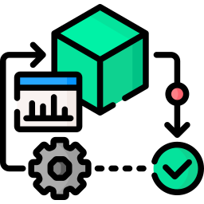
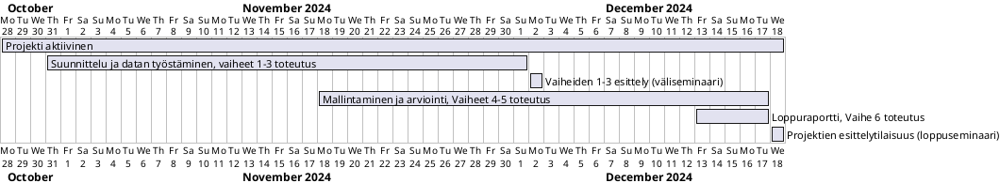

# Projektisuunnitelma

## Tekijät: Jere Soininen, Pekka Pöyhönen, Sara Koskinen, Valtteri Pohto

## Kurssityö: AI / DA -Projekti TTC8070-3007

 

### Tiivistelmä:
AI / DA -Projekti -kurssin työnä suunniteltiin ja toteutettiin AI / DA -moduulin aihealueeseen liittyvää data-analyysi projekti. Projektityössä on tarkoituksena analysoida dataa liittyen käytettyjen autojen myyntiä ja tuottaa asiakkaalle sen avulla lisäarvoa.

## 1.	Tausta ja lähtökohdat  

### 1.1.	TILANNE 
Projektissa autokauppaketju on antanut toimeksiannon data-analyysistä. Tavoitteena on kehittää asiakkaan liiketoimintaa ja parantaa kilpailukykyä. Käytössä on suuri määrä dataa, jossa on monenlaisia tietoja, kuten autojen malli-, hinta- ja kokotiedot. Kattava otanta mahdollistaa syvällisen analyysin ja mallintamisen kone- tai syväoppimisen malleissa. Dataa on kuitenkin tutkittava, jaoteltava, korjattava ja jatkojalostettava, jotta sitä voidaan hyödyntää analysoinnissa ja mallintamisessa.

### 1.2.	ASIAKAS

Asiakas on Yhdysvalloissa toimiva autokauppaketju, joka keskittyy käytettyjen autojen vähittäismyyntiin Yhdysvaltojen markkinoilla. Asiakaskunta koostuu pääasiassa kotitalouksista, jotka etsivät kustannustehokkaita kuljetusvaihtoehtoja eri elämänvaiheisiin. Liiketoiminnassa korostuu asiakaslähtöinen lähestymistapa, jossa pyritään tarjoamaan kestäviä, edullisia ja laadukkaita ajoneuvoja jokaisen asiakkaan tarpeita vastaamaan.

Yrityksen ydintoiminta keskittyy käytettyjen autojen hankintaan, varastointiin, markkinointiin ja jälleenmyyntiin. Käytettyjen autojen kysyntä on kasvanut Yhdysvalloissa, mikä kasvattaa markkinoiden kilpailua jatkuvasti. Yhtenä kilpailuvalttina yritys haluaa hyödyntää data-analytiikkaa liiketoimintansa kehittämisessä ja strategisten päätösten tukemisessa.
Yritys kertoo, että keskeisinä liiketoimintahaasteina ovat varastonhallinta ja hintastrategia. Yrityksellä on suuret varastokustannukset ja tehokkaalla varaston kierrolla olisi positiivisia vaikutuksia liiketoiminnan kannattavuudelle. Nopeat myynnit ovat ensiarvoisen tärkeitä, jotta ajoneuvot eivät jää varastoon niiden arvon laskiessa. Käytettyjen autojen hinnat vaihtelevat suuresti riippuen esimerkiksi ajoneuvotyypin, iän, ajokilometrien, merkin ja lisäominaisuuksien mukaan. Oikean hinnan määritteleminen on haasteellista ja aikaa vievää, johon toivotaan ratkaisua data-analytiikan keinoin. 

## 2.	TAVOITTEET 

### 2.1.	Data-analyysin ja mallintamisen tavoitteet

-	Luoda selkeä kuva käytettävästä datasta
-	Luoda integroitu, puhdistettu ja muotoiltu tietojoukko
-	Luoda koneoppimismalli numeerisilla tuloksilla ja visualisoinnilla
-	Arvioida ja tarkistaa mallin toimivuus

### 2.2.	Mallintamisen tavoitteet

-	Luodaan regressiomalli autojen myyntihinnan ennustamiseen
-	Luodaan luokittelumalli luokittelemaan autot nopeasti kaupaksi meneviin ja ei nopeasti kaupattaviin

### 2.3.	Projektin tavoitteet

Projektin tavoitteena on tuottaa asiakkaalle Data-analyysin avulla lisää tietämystä heidän liiketoimintaansa liittyen, tehostaen autojen myyntiä. Projektissa luodaan asiakkaalle selkeä kuva siitä, mikä vaikuttaa autojen myyntihintaan ja siihen, kuinka nopeasti auto kaupataan. Data-analyysistä pyritään löytämään myös muita tekijöitä, jotka vaikuttavat autokauppaketjun kannattavuuteen. Projektin tavoitteet täytyy suhteuttaa käytettävissä olevaan aikaan.

-	Data-analyysin ja mallintamisen vaiheiden jälkeen suunnitellaan ja toteutetaan käyttöönotto, seuranta ja huolto
-	Luodaan loppuraportti, kunnossapitodokumentaatio ja suunnitelma. 

### 2.4.	Projektin päättyminen

-	Projekti päätetään, kun loppuraportti ja mallintamisen aikana tuotettu malli on otettu käyttöön ja se on asiakkaan täysimääräisessä käytössä. Tuki- ja ylläpitopalvelusta sovittu erillisessä sopimuksessa.

## 3.	HAASTEET 
Projektin haasteeksi on todettu: 

-	tiukka aikataulu (7,5 viikkoa)
-	suuri ja osittain vajavainen lähtödata
-	vaatimusmäärittelyn puutteellisuus
-	tuloksen/tulosten mittaamisen ja arvioimisen hankaluus?

## 4.   AIKATAULU 

Projektille on annettu aikatauluksi 7,5 viikkoa alkaen 28.10.2024 ja päättyen 18.12.2024 loppuseminaariin. Alla on kuvattu suuntaa antava aikataulu. Koska käytössä on CRISP-DM, kuusivaiheinen prosessimalli dataan perustuvan projektin toteuttamiseen, voidaan odottaa iteratiivista etenemistä vaiheiden välillä.

## 5.   PROJEKTIN VAIHEET 

- [Vaihe 2](https://gitlab.labranet.jamk.fi/AC7766/aida-projekti-syksy-2024-ryhma-1/-/blob/main/docs/Phase%202/phase_2_results.ipynb?ref_type=heads) - Datan ymmärrys

- [Vaihe 3](https://gitlab.labranet.jamk.fi/AC7766/aida-projekti-syksy-2024-ryhma-1/-/blob/main/docs/Phase%203/phase_3_results.ipynb?ref_type=heads) - Esikäsittely

- [Vaihe 4](https://gitlab.labranet.jamk.fi/AC7766/aida-projekti-syksy-2024-ryhma-1/-/blob/main/docs/Phase%204/phase_4_results.ipynb?ref_type=heads) - Mallinnus

- [Vaihe 5](https://gitlab.labranet.jamk.fi/AC7766/aida-projekti-syksy-2024-ryhma-1/-/blob/main/docs/Phase%205/phase_5_results.ipynb?ref_type=heads) - Arviointi

- [Vaihe 6](https://gitlab.labranet.jamk.fi/AC7766/aida-projekti-syksy-2024-ryhma-1/-/blob/main/docs/Phase%206/phase_6_results.md?ref_type=heads) - Käyttöönotto

- [Loppuraportti](https://gitlab.labranet.jamk.fi/AC7766/aida-projekti-syksy-2024-ryhma-1/-/blob/main/docs/Phase%207%20Final%20report/final_report.md?ref_type=heads)

## 6.   TIIMI 

Tiimi koostuu neljästä kolmannen vuoden tieto- ja viestintätekniikan opiskelijasta, jotka kaikki suorittavat ammattiopintoina data-analytiikan ja tekoälyn opintokokonaisuutta (AI/DA-opintojaksoja) syksyllä 2024. Tiimillä on perusosaamista data-analytiikan, koneoppimisen ja tekoälyn menetelmistä sekä kokemusta datan käsittelystä ja analyysistä Python-ohjelmointikielen avulla. Tiimillä on vahva motivaatio soveltaa aiemmin oppimaansa käytännössä ja innostusta ratkaista liiketoimintaongelmia analytiikan ja koneoppimisen avulla.

### 6.1.    Roolit ja vastuut

Datan esikäsittelijät:
-	Vastaavat datan puhdistuksesta ja esikäsittelystä
-	Tekee alkuanalyysit mitkä ominaisuudet vaikuttavat eniten auton hintaan ja myyntiaikaan.

Mallinnuksesta vastaavat: 
-	Kehittävät ennustemallit hintojen ja myyntiajan arvioimiseen sekä testaa eri algoritmeja esim. regressio- ja luokittelumenetelmiä.

Visualisoinnista vastaavat:
-	Vastaavat tulosten visualisoinnista selkeäksi ja informatiiviseksi asiakkaan kannalta. 
-	Toteutetaan graafeja esim. myyntinopeuksista, lisävarusteiden vaikutuksesta.

Dokumentaatio ja projektin seuranta:
-	Dokumentoivat projektin tuloksia ja tekee suositukset asiakkaalle analyysitulosten perusteella. 
-	Seurataan, että projekti etenee suunnitellun aikataulun mukaisesti ja palautukset tulee tehtyä ajallaan

Seuraavassa taulukossa on eriteltynä vastuualueet ja niiden kuvaukset sekä ketkä projektiryhmän jäsenet ovat pääasiallisesti vastuussa kustakin tehtävästä.

### 6.2.    Tarvittavat työkalut ja teknologiat

Projektin toteuttamiseen käytettävät teknologiat valitaan tiimin taitojen ja asiakkaan tarpeen mukaan. Pääpaino on aiemmilla kursseilla tutuiksi tulleissa työkaluissa, jotka ovat laajasti käytössä datatieteessä yleensä. 

1. Ohjelmointi ja datan esikäsittely:
    - __Python__ on pääasiallisena ohjelmointikielenä datan käsittelyyn, analyysiin ja mallinnukseen.
    - __Pandas ja NumPy__ ovat data-analyysin ja -käsittelyn työkalut, joilla muokataan ja esikäsitellään suurta määrää dataa tehokkaasti.

2. Koneoppiminen ja mallinnus:
    - __Scikit-learn__:ia käytetään koneoppimismallien rakentamiseen ja arviointiin. Se sisältää mm. helppokäyttöisiä regressio-, luokittelu ja klusterointialgoritmeja.
    - __TensorFlow ja Keras__  Tarjoavat alustan syväoppimismallien rakentamiseen.

3.	Visualisointi ja raportointi:
    - __Matplotlib ja Seaborn__ -kirjastoja käytetään visualisointien luomiseen ja analysointitulosten selkeyttämiseksi. 

4.	Projektinhallinta ja dokumentointi:
    - __GitLab__ projektinhallintaan ja tehtävien seuraamiseen.
    - __Microsoft Office__ raportointiin ja dokumentaatioon.
    - __Teams__ yhteisiin kokouksiin ja yhteydenpitoalustana.