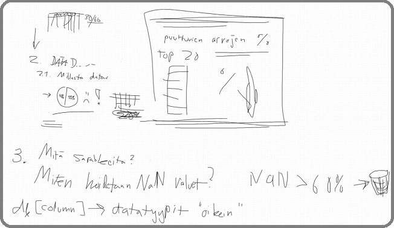

## Phase 6 (Deployment Plan)

## 1. Toimivan mallin integrointi asiakkaalle käytöön

Käytettyjen autojen hinnan ennustaja voidaan ottaa käyttöön muutamilla erilaisilla tavoilla. Koska asiakas ei ole vielä tästä selkeää toivettaan ilmoittanut, annetaan erilaisia vaihtoehtoja.

### 1.1 Integraatio olemassa olevaan järjestelmään

Hinnan ennustaja yhdistetään suoraan asiakkaan myyntityökaluun tai varasto-ohjelmistoon. Kun auton tiedot syötetään normaalisti sisään, toimii hinnan ennustaja siinä "kyljessä" ehdottaen myyntihintaa. Käyttäjä voi halutessaan vielä muokata hintaa, mutta malli tarjoaa suoraan hinnan, ilman että sitä tarvitsee itse miettiä. Erillisiä kirjauksia muihin järjestelmiin ei tarvita tässä tapauksessa.

1. Malli pakataan .pkl tai joku muu universaali muoto
2. Luodaan API, käytetään kevyttä web-palvelinkehystä Flask, FastAPI jne.
3. Integraatio, liitetään API osaksi backendiä (asiakkaan järjestelmä), varmistetaan kutsujen läpimeno, tarvittaessa middleware -kerros, joka muuttaa syötteet ja vastaukset oikeisiin muotoihin.
4. Luodaa logi seuraamaan mm. ennusteiden käyttömäärää, virheitä, suorituskykyä

Käyttöliittymä on käytännössä sama mikä asiakkaalla on tällähetkellä, järjestelmään luodaan vain **Ennusta hinta** -painike.

_Esimerkki kokonaisprosessista:_
* Malli testataan ja tallennetaan lokaalisti.
* Luodaan API ja testataan sitä lokaalisti asiakkaan esimerkkidatalla.
* Kontitetaan API ja malli Dockerilla ja asennetaan se asiakkaan palvelimelle.
* Toteutetaan tietoturva ja logitus.
* Integroidaan asiakkaan järjestelmään ja suoritetaan testaukset.
* Seurataan käyttöä ja suorituskykyä monitorointityökaluilla.

### 1.2 Webkäyttöliittymä

Kevyt HTML, CSS, JavaScript pohjainen ohjelma, jolla myyntiedustaja voi tarkistaa auton myyntihinnan syöttämällä tarpeelliset tiedot autosta. Kevyt pystyttää, erillinen sovellus, mutta tiedot voidaan joutua kirjoittamaan turhaan useaan kertaan. Tätä varten pitää luoda vienti ohjelmasta ohjelmaan turhan työn välttämiseksi.

Käyttöliittymä on selkeä, tietokentät sisältävä, tekstiä ennustava kevyt kokonaisuus. Virheiden mimimoimiseksi, lisävarusteet valitaan valmiista listasta, yleisimmät täpättävissä, loput alasvetovalikosta etsittävissä.

## 2. Mallin käytön suunnitelma

### 2.1 Ohjelman käyttö

* Asiakkaalle laaditaan selkeät käyttöohjeet
* Järjestelmään luodaan käyttöoikeudet yhtäaikaiselle käytölle
* Ohjelmaan luodaan tietojen oikeellisuutta vaalivat tietojen syöttökentät, mitkä estävät vääränlaisten tietojen tai tietotyyppien joutumisen niille kuulumattomiin paikkoihin
* Ohjelmaan upotetaan helposti saatavilla oleva nappi/lomake, jolla voidaan ilmoittaa virheistä, bugeista ja antaa kehitysehdotuksia.

### 2.2 Päivitys ja uudelleenkoulutus

Koska käytettyjen autojen ominaisuudet ja hinnat voivat muuttua ajan myötä, täytyy mallia kouluttaa määräajoin uudestaa tarkan hintaennusteen saamiseksi. 

* Ohjelmaan lisätään automaatio, mikä kouluttaa mallin uudelleen 3kk välein uusimmalla datalla kaupaksi menneistä autoista.
* Mikäli ennustetarkkuus heikkenee äkillisesti, lähettää ohjelma tästä vikailmoituksen automaattisesti käyttäjälle ja ylläpidolle.
* Ylläpito saa automaattisesti raportit järjestelmästä ja mallin toimivuudesta, jotta voi kehittää omaa ja asiakkaan toimintaa ennakoivasti

### 2.3 Uusien ominaisuuksien lisääminen

* Ohjelmaan luodaan lisäominaisuuksien lisääminen, mikä lisää dataan sarakkeen tyyliin "ominaisuus löytyy" = 1 ja "ei löydy" = 0.
* Asiakkaalle luodaan ohjeet miten lisätä lisäominaisuudet

### 2.4 Esimerkki ohjelman käytöstä

1. Auton tiedot syötetään myyntijärjestelmään tai erilliseen web-käyttöliittymään
2. Malli ennustaa hinnan
3. Hinta näkyy käyttäjälle, joka voi hyväksyä sen ja siirtyä eteenpäin prosessissa tai muokata hintaa

### 2.5 Käyttäjäkunta

1. Autoliikkeiden myyntiedustajat
* Tarvitsevat jatkuvasti esim. myyntejä tehdessä vaihdossa tulevien autojen hinnoittelun tueksi
  
2. Markkinointi
* Markkinointitiimi voi tehdä hintaennusteita autoista ja tuottaa parempia kampanjoita

3. Operatiivinen johto
* Voivat tehdä ennusteita ja hakea tietoa ennustettavista hinnoista ja päätyä tarkempiin ja kannattavampiin suunnitelmiin.

## 3. Loppuraportti

Yhteenveto projektista, joka sisältää lopullisen esityksen tiedonlouhinnan tuloksista.

*TÄNNE LOPPURAPORTTI*

## 4. Projektin loppusanat

_Projektin retrospektiivi, jossa arvioidaan, mikä sujui hyvin, mitä olisi voinut tehdä paremmin ja miten toimintaa voidaan parantaa tulevaisuudessa._

#### Alkuvaihe

Projektin alussa ryhmän jäsenet tulivat hyvin toimeen keskenään, mikä loi vahvan pohjan yhteistyölle. Tavoite oli alusta asti selkeä ja yhteinen, minkä ansiosta työ käynnistyi nopeasti ja tehokkaasti. Työt jaettiin ryhmässä tasapuolisesti, ja kommunikaatio sujui hyvin. Näillä saatiin hommat käyntiin ja motivoiva alku projektille.

#### Keskivaihe

Projektin keskivaiheessa kohdattiin haasteita. Vaiheen 3 datan siivoaminen osoittautui odotettua suuremmaksi tehtäväksi, joka vaati sekä paljon aikaa että tietokoneen laskentatehoa. Ryhmää koettelivat myös jäsenten sairastumiset ja muut velvollisuudet, jotka hidastivat vaiheiden 1–3 valmistumista. Näistä esteistä huolimatta ryhmä onnistui hyvällä tsempillä, yhteistyöllä ja sinnikkyydellä saamaan ensimmäisen puoliskon 1-3 vaiheet kunnialla valmiiksi.

#### Loppuvaihe

Projektin loppuvaiheessa kohtasimme lisää sairastumisia, mikä hidasti mallintamisen tekemistä, tulosten analysointia ja projektin lopullista valmistumista. Vaikka loppurutistus vei odotettua kauemmin, projekti saatiin lopulta valmiiksi. Loppuvaihe osoitti, miten tärkeää on varautua yllättäviin haasteisiin ja luoda tilaa joustavuudelle aikatauluissa.

*Parannusehdotukset tulevaisuuteen*

1. Riskienhallinta: Jatkossa voisimme laatia kattavamman riskienhallintasuunnitelman, joka huomioi esimerkiksi sairastumiset ja tekniset haasteet.

2. Resurssien optimointi: Datan siivoamiseen ja raskaisiin laskentatehtäviin voitaisiin varata paremmin resursseja, kuten tehokkaampia tietokoneita tai ulkoisia palveluita.

3. Aikataulun joustavuus: Suunnittelemme tulevaisuudessa aikataulut niin, että ne sallivat paremmin yllättäviä viivästyksiä.

4. Kommunikaation jatkokehittäminen: Vaikka kommunikaatio toimi hyvin, voitaisiin käyttää jotain mobiilia viestintäsovellusta nopeampaa kommunikaatiota varten. Se auttaisi hallitsemaan edistymistä ja reagoimaan kiireiseen ja hajautettuun työtilanteeseen.

Tämä projekti opetti meille paljon tiimityöstä, haasteiden ylittämisestä ja tehokkaasta projektinhallinnasta. Olemme valmiita soveltamaan tämän projektin oppeja tulevissa hankkeissa.

